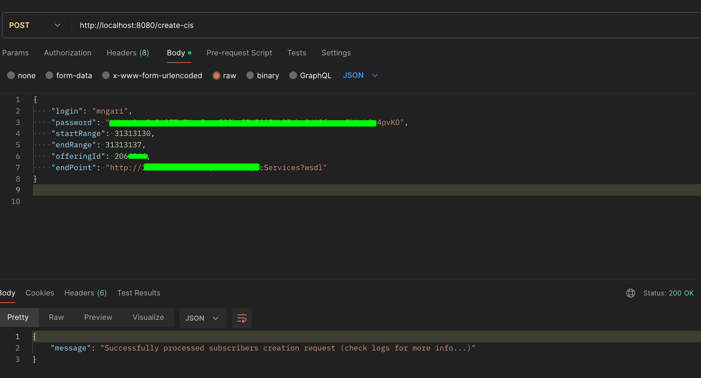
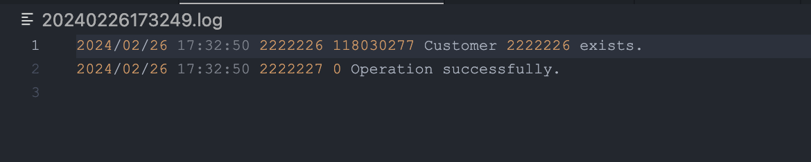

Go code that creates a new subscriber on a Huawei mobile network. The program first generates a request message in XML format. The request message includes the following information:

- The subscriber's MSISDN (mobile phone number)
- The subscriber's name and contact information
- The subscriber's account information
- The subscriber's service plan
- The program then sends the request message to the Huawei network using the HTTP POST method. The program then receives a response message from the network. - The response message includes the following information:
  - The result code of the request
  - The result description of the request
  - The program then prints the MSISDN, the result code, and the result description of the request.

